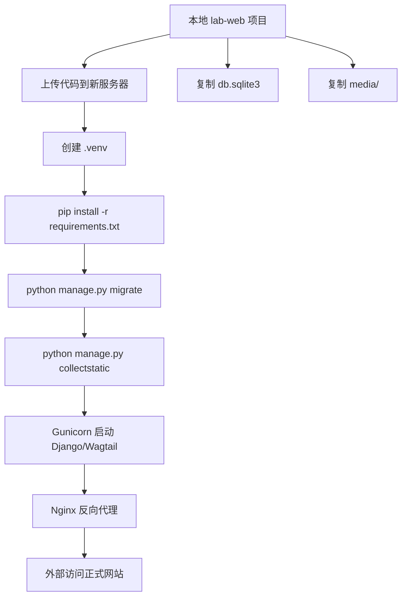
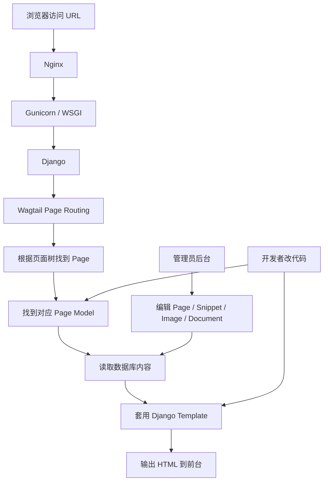
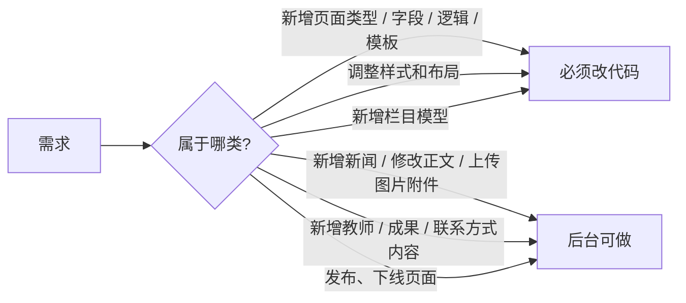
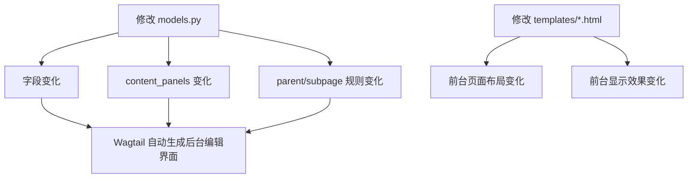
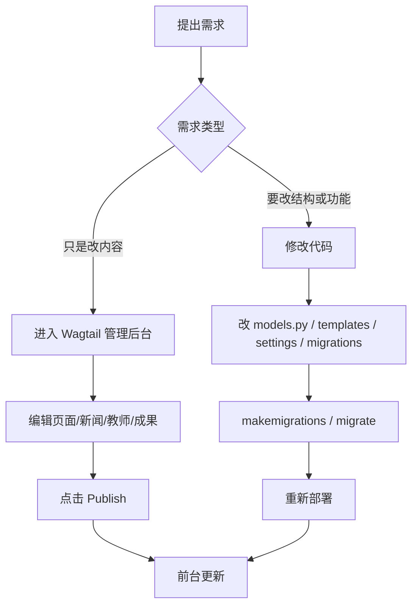
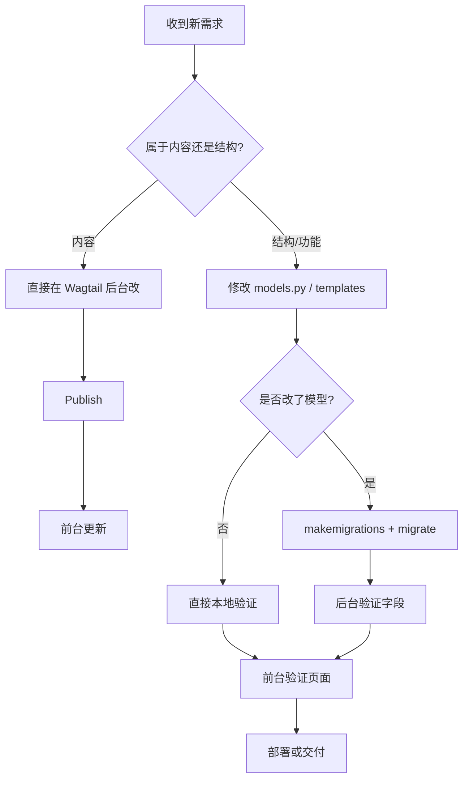

# Wagtail 开发、部署与后台分工说明

## 1. 那个 WARNING 是什么意思

你运行：

```bash
python manage.py runserver
```

时看到这段提示：

```text
WARNING: This is a development server. Do not use it in a production setting.
Use a production WSGI or ASGI server instead.
```

意思是：

- 你现在跑的是 `Django` 自带的开发服务器
- 它只适合本地调试
- 不适合正式对外提供服务

### 为什么不适合生产环境

因为 `runserver` 的设计目标是：

- 方便开发
- 自动重载代码
- 本地快速调试

它不是为这些场景设计的：

- 高并发访问
- 长时间稳定运行
- 生产环境安全控制
- 正式日志、进程守护、反向代理

### 正确理解

可以这样区分：

- 本地开发：`runserver`
- 正式上线：`Nginx + Gunicorn + Django/Wagtail`

对你这个项目，推荐的生产部署方式是：

```text
Nginx
  -> Gunicorn
    -> Django / Wagtail
      -> SQLite 或 PostgreSQL
      -> media/
```

### 这不是报错

这个 warning 不是异常，也不是配置坏了。  
它只是提醒你：

`现在这个服务能开发用，但不能直接当正式网站上线。`

## 2. 网站部署到别的服务器，怎么迁移

### 2.1 你现在这个站由哪几部分组成

当前 `lab-web` 项目的核心数据有三部分：

- 代码目录：`lab-web/`
- 数据库：[db.sqlite3](/mnt/c/Users/zli/OneDrive/work/学院干活/国重建设/国重评估报告/lab-web/db.sqlite3)
- 上传文件目录：[media](/mnt/c/Users/zli/OneDrive/work/学院干活/国重建设/国重评估报告/lab-web/media)

另外还有静态资源：

- 前端模板和源码
- `collectstatic` 之后的 `static/`

### 2.2 最简单的迁移方式

如果你想先把现在的网站完整搬到另一台服务器，最直接的办法是：

1. 把整个 `lab-web` 目录拷过去
2. 在新服务器创建 Python 虚拟环境
3. 安装依赖
4. 保留数据库 `db.sqlite3`
5. 保留上传文件 `media/`
6. 运行迁移和静态文件收集
7. 用 `gunicorn` 启动
8. 用 `nginx` 反向代理

### 2.3 最小迁移步骤

假设目标服务器是 Linux。

#### 步骤 1：上传项目

把整个项目目录上传到服务器，例如：

```text
/srv/lab-web
```

#### 步骤 2：创建虚拟环境并安装依赖

```bash
cd /srv/lab-web
python3 -m venv .venv
source .venv/bin/activate
pip install -r requirements.txt
```

#### 步骤 3：保留数据库和媒体文件

确认这两个东西也一起过去了：

- `db.sqlite3`
- `media/`

#### 步骤 4：运行迁移

```bash
python manage.py migrate
```

#### 步骤 5：收集静态文件

```bash
python manage.py collectstatic --noinput
```

#### 步骤 6：启动 Gunicorn

```bash
gunicorn labsite.wsgi:application --bind 127.0.0.1:8000
```

#### 步骤 7：Nginx 反向代理

Nginx 一般负责：

- `/static/` 指向静态文件目录
- `/media/` 指向媒体文件目录
- `/` 代理到 `127.0.0.1:8000`

### 2.4 推荐的正式部署方式

对正式网站，建议：

- 服务器系统：Linux
- 应用服务：Gunicorn
- Web 服务器：Nginx
- 数据库：优先 PostgreSQL

### 2.5 你现在用 SQLite，可以先上线吗

可以，但更适合：

- 内部预览
- 小流量网站
- 初期快速上线

如果将来正式长期运行，更建议改成 `PostgreSQL`。

### 2.6 部署到新服务器前要检查什么

至少要确认这些：

- `DEBUG = False`
- `ALLOWED_HOSTS` 正确
- `SECRET_KEY` 放环境变量
- `WAGTAILADMIN_BASE_URL` 配成正式域名
- `media/` 会备份
- 执行：

```bash
python manage.py check --deploy
```

### 2.7 一张迁移流程图



## 3. Wagtail 的原理

### 3.1 一句话理解

`Wagtail = Django + 页面树 + 后台编辑器 + 页面模型`

你不是先做一堆静态 html，再想办法加后台；而是：

- 先定义页面类型
- Wagtail 自动给你后台编辑入口
- 管理员在后台录入内容
- 前台模板负责显示

### 3.2 工作过程

当浏览器访问一个 URL 时，大致过程是：

1. 请求到 Django / Wagtail
2. Wagtail 根据页面树找到对应页面
3. 页面实例对应某个 `Page Model`
4. 读取数据库里的页面内容
5. 套用对应模板
6. 返回 HTML

### 3.3 Wagtail 原理图



### 3.4 后台和代码分别负责什么



### 3.5 为什么没写 admin 代码，后台还是会变

这点是 `Wagtail` 很重要的机制：

`Wagtail 会根据你写的 Page Model 自动生成后台编辑界面。`

所以你虽然没有专门去写一套后台页面，但后台实际上已经被你改了，只是改法不是传统 Django 里单独写 `admin.py`，而是通过页面模型定义来间接控制。

### 3.6 哪些代码改动会直接影响后台

以下这些改动会直接改变管理员后台的编辑界面：

#### 1. 新增字段

例如在某个页面模型里新增：

```python
phone = models.CharField(...)
```

那么后台编辑页通常就会多一个输入框。

#### 2. 修改字段类型

字段类型会决定后台控件长什么样，例如：

- `CharField`：单行输入框
- `TextField`：多行文本框
- `RichTextField`：富文本编辑器
- `StreamField`：模块化内容编辑器
- 图片相关 `ForeignKey`：图片选择器

#### 3. 修改 `content_panels`

例如：

```python
content_panels = BasePage.content_panels + [
    FieldPanel("introduction"),
    FieldPanel("hero_cta"),
    FieldPanel("body"),
]
```

这相当于告诉 `Wagtail`：

- 后台应该显示哪些字段
- 字段显示顺序是什么
- 用什么面板来组织它们

#### 4. 修改 `parent_page_types` 和 `subpage_types`

这会影响后台里：

- 某个页面下面能新建什么类型的子页面
- 某个页面允许挂在哪些父页面下面

#### 5. 修改 Snippet / Settings 模型

例如导航、页脚、站点设置，如果对应模型改了，后台相关的设置界面也会跟着变。

### 3.7 哪些改动通常只影响前台，不影响后台结构

这些改动一般不会改变后台的编辑表单结构：

- 修改 `templates/*.html`
- 修改 CSS
- 修改前台 JS
- 调整字段在前台的显示顺序
- 调整新闻卡片、按钮、区块的视觉样式

例如修改：

- `templates/pages/home_page.html`
- `templates/pages/contact_page.html`
- `templates/navigation/header.html`

通常影响的是：

- 页面怎么展示
- 区块怎么排版
- 前台长什么样

而不是后台出现哪些字段。

### 3.8 放到你这个 lab 项目里怎么理解

在当前 `lab-web` 项目中：

- 改 `labsite/home/models.py`
- 改 `labsite/news/models.py`
- 改 `labsite/standardpages/models.py`

这些改动会直接影响：

- 后台字段
- 后台表单结构
- 页面允许新建的位置
- 页面允许挂载的类型

而修改：

- `templates/pages/home_page.html`
- `templates/pages/news_listing_page.html`
- `templates/pages/faculty_page.html`
- `templates/pages/contact_page.html`

这些改动主要影响：

- 前台显示效果
- 页面布局
- 模块视觉结构

### 3.9 一个最直接的理解方式

可以把它理解成：

```text
models.py = 后台数据结构 + 后台编辑规则 + 页面规则
templates/*.html = 前台展示
```

所以并不是“你没改 admin”，而是：

`你已经通过 Page Model 和 content_panels 改了 admin。`

### 3.10 一张简图



## 4. 在你这个 lab 版本里，哪些事必须改代码

### 4.1 必须改代码的事情

这些事情，管理员后台做不了，必须找你改代码：

- 新增一种页面类型  
  例如：下载中心、招生招聘、国际合作、合作导师

- 页面新增字段  
  例如：教师页增加“办公时间”、成果页增加“DOI”

- 调整首页布局和视觉  
  例如：首页改成学校官网风格、增加轮播区、修改配色和布局

- 改页面模板  
  例如：新闻列表改成双栏、教师页改成卡片式详情布局

- 改自动聚合逻辑  
  例如：首页自动显示最新 8 条新闻、只显示置顶通知

- 改 URL 规则  
  例如：把某个页面路径从 `/research/` 改成 `/scientific-research/`

- 改权限和工作流  
  例如：新闻只能编辑发布，栏目结构只能管理员改

### 4.2 这个 lab 版本里，已经改过的核心代码文件

当前项目里，这些文件是和你这个实验室站直接相关的核心实现：

#### 站点设置与基础配置

- 相对路径：`labsite/settings/base.py`
- 文件链接：[labsite/settings/base.py](/mnt/c/Users/zli/OneDrive/work/学院干活/国重建设/国重评估报告/lab-web/labsite/settings/base.py)

这里改了：

- 中文语言 `zh-hans`
- 时区 `Asia/Shanghai`
- 站点名 `全国重点实验室`
- 本地缓存配置

#### 首页模型

- 相对路径：`labsite/home/models.py`
- 文件链接：[labsite/home/models.py](/mnt/c/Users/zli/OneDrive/work/学院干活/国重建设/国重评估报告/lab-web/labsite/home/models.py)

这里改了：

- `HomePage` 的子页面类型限制
- 首页上下文数据
- 首页自动聚合：
  - 最新新闻
  - 推荐师资
  - 推荐成果

#### 实验室站点页面模型

- 相对路径：`labsite/standardpages/models.py`
- 文件链接：[labsite/standardpages/models.py](/mnt/c/Users/zli/OneDrive/work/学院干活/国重建设/国重评估报告/lab-web/labsite/standardpages/models.py)

这里改了/新增了：

- `StandardPage`
- `FacultyIndexPage`
- `FacultyPage`
- `AchievementIndexPage`
- `AchievementPage`
- `ContactPage`

这些模型决定了：

- 后台有哪些字段
- 页面能挂在哪个栏目下面
- 前台列表和详情页怎么查数据

#### 首页模板

- 相对路径：`templates/pages/home_page.html`
- 文件链接：[templates/pages/home_page.html](/mnt/c/Users/zli/OneDrive/work/学院干活/国重建设/国重评估报告/lab-web/templates/pages/home_page.html)

这里改了：

- 首页主视觉区
- `hero_cta`
- `body`
- 新闻区块
- 师资区块
- 科研成果区块

#### 师资相关模板

- 相对路径：`templates/pages/faculty_index_page.html`
- 文件链接：[templates/pages/faculty_index_page.html](/mnt/c/Users/zli/OneDrive/work/学院干活/国重建设/国重评估报告/lab-web/templates/pages/faculty_index_page.html)
- 相对路径：`templates/pages/faculty_page.html`
- 文件链接：[templates/pages/faculty_page.html](/mnt/c/Users/zli/OneDrive/work/学院干活/国重建设/国重评估报告/lab-web/templates/pages/faculty_page.html)

#### 科研成果相关模板

- 相对路径：`templates/pages/achievement_index_page.html`
- 文件链接：[templates/pages/achievement_index_page.html](/mnt/c/Users/zli/OneDrive/work/学院干活/国重建设/国重评估报告/lab-web/templates/pages/achievement_index_page.html)
- 相对路径：`templates/pages/achievement_page.html`
- 文件链接：[templates/pages/achievement_page.html](/mnt/c/Users/zli/OneDrive/work/学院干活/国重建设/国重评估报告/lab-web/templates/pages/achievement_page.html)

#### 联系我们模板

- 相对路径：`templates/pages/contact_page.html`
- 文件链接：[templates/pages/contact_page.html](/mnt/c/Users/zli/OneDrive/work/学院干活/国重建设/国重评估报告/lab-web/templates/pages/contact_page.html)

#### 导航模板

- 相对路径：`templates/navigation/header.html`
- 文件链接：[templates/navigation/header.html](/mnt/c/Users/zli/OneDrive/work/学院干活/国重建设/国重评估报告/lab-web/templates/navigation/header.html)

这里改了：

- 手机端导航链接实际跳转地址

#### 站点初始化迁移

- 相对路径：`labsite/standardpages/migrations/0003_bootstrap_lab_site.py`
- 文件链接：[labsite/standardpages/migrations/0003_bootstrap_lab_site.py](/mnt/c/Users/zli/OneDrive/work/学院干活/国重建设/国重评估报告/lab-web/labsite/standardpages/migrations/0003_bootstrap_lab_site.py)

这里做了：

- 自动创建首页
- 自动创建一级栏目
- 自动创建部分二级页
- 自动写入主导航和页脚导航
- 自动补齐初始化页面的正规发布流程

## 5. 在你这个 lab 版本里，哪些事情后台可以做

管理员后台现在可以直接做这些事：

- 修改首页标题和简介
- 修改首页 `hero_cta`
- 修改首页 `body`
- 新增和编辑“实验室概况”正文
- 新增和编辑“党建工作”正文
- 新增新闻
- 发布新闻
- 新增教师页面
- 修改教师信息
- 新增成果页面
- 修改联系我们里的地址、邮箱、电话
- 上传图片和附件
- 发布和下线页面

## 6. 一个简单判断规则

### 要改代码的时候

如果你的需求是这些关键词：

- “新增一种页面”
- “加一个字段”
- “改样式”
- “改页面结构”
- “自动显示什么内容”
- “改路径规则”

那通常就是：

`必须改代码`

### 可以后台做的时候

如果你的需求是这些关键词：

- “发新闻”
- “改文字”
- “上传图片”
- “补联系方式”
- “增加一个教师”
- “新增一条科研成果”

那通常就是：

`后台可以做`

## 7. 给你一个面向实际维护的总流程



## 8. 建议你接下来怎么做

对于这个项目，建议分两类维护：

### 内容维护

交给后台管理员做：

- 发新闻
- 加教师
- 补成果
- 改联系方式
- 更新首页文案

### 系统维护

交给会代码的人做：

- 新增栏目
- 改模板
- 改视觉风格
- 上线部署
- 升级依赖
- 数据迁移

## 9. 一句话结论

- `runserver` 的 warning 只是提醒你：现在是开发环境，不是生产环境
- 网站迁移到别的服务器，本质上就是迁代码、数据库、媒体文件，再用 `Gunicorn + Nginx` 跑起来
- `Wagtail` 的核心机制是：代码定义结构，后台维护内容
- 在你现在这个 `lab` 版本里：
  - 改结构、改字段、改模板、改逻辑：找代码
  - 发内容、改文本、传图片、发布页面：走管理员后台

## 10. 后续开发规则

这一节不是框架规则，而是建议后续继续维护这个 `lab-web` 项目时遵守的项目约定。

### 10.1 总原则

后续开发时，优先遵守这条：

`内容通过后台维护，结构通过代码维护。`

也就是说：

- 改新闻、正文、图片、联系方式：优先后台
- 改字段、页面类型、模板、自动聚合逻辑：优先代码

### 10.2 改需求时先判断属于哪一类

#### A. 纯内容需求

例如：

- 发一条新闻
- 改首页一段文字
- 上传教师照片
- 补一个成果页面
- 修改联系我们信息

处理方式：

- 不改代码
- 不改 migration
- 直接在后台操作

#### B. 结构或功能需求

例如：

- 首页增加一个新模块
- 新增“下载中心”
- 教师页增加“办公时间”
- 新闻列表增加筛选
- 联系我们页增加地图字段

处理方式：

- 改 `models.py`
- 必要时改 `templates/*.html`
- 然后执行 `makemigrations` 和 `migrate`

### 10.3 推荐的改动入口

后续开发时，优先从下面这些文件开始找：

#### 首页相关

- `labsite/home/models.py`
- `templates/pages/home_page.html`

#### 新闻相关

- `labsite/news/models.py`
- `templates/pages/news_listing_page.html`
- `templates/pages/article_page.html`

#### 普通正文、师资、成果、联系我们

- `labsite/standardpages/models.py`
- `templates/pages/standard_page.html`
- `templates/pages/faculty_index_page.html`
- `templates/pages/faculty_page.html`
- `templates/pages/achievement_index_page.html`
- `templates/pages/achievement_page.html`
- `templates/pages/contact_page.html`

#### 导航与站点设置

- `labsite/navigation/models.py`
- `templates/navigation/header.html`
- `templates/navigation/footer.html`

#### 可复用区块

- `labsite/utils/blocks.py`

### 10.4 后续新增字段的标准流程

如果要给某个页面新增字段，建议按这个顺序做：

1. 修改对应 `models.py`
2. 把新字段加到 `content_panels`
3. 如有前台展示需求，修改对应 `templates/*.html`
4. 执行：

```bash
python manage.py makemigrations
python manage.py migrate
```

5. 进入后台验证新字段是否出现
6. 再验证前台是否正确显示

### 10.5 后续新增页面类型的标准流程

如果要新增一种页面类型，例如“下载中心页”，建议按这个顺序做：

1. 在对应 app 的 `models.py` 新增一个新的 `Page` 类
2. 指定：
   - `template`
   - `parent_page_types`
   - `subpage_types`
   - `content_panels`
3. 新建或复用一个模板文件
4. 执行：

```bash
python manage.py makemigrations
python manage.py migrate
```

5. 去后台确认该页面类型可以在指定父页面下新建
6. 再补前台样式和内容

### 10.6 不建议直接修改旧 migration

一般情况下：

- 不要去改 `0001_initial.py`
- 不要去改已经执行过的旧 migration

推荐做法是：

- 改 `models.py`
- 让 Django 生成新的 migration，例如 `0004_xxx.py`

只有少数情况才手改 migration，例如：

- 一次性初始化数据
- 一次性数据修复
- 自动生成的迁移不够准确

### 10.7 `0003_bootstrap_lab_site.py` 的使用规则

文件：

- `labsite/standardpages/migrations/0003_bootstrap_lab_site.py`

建议理解为：

- 这是“初始化站点骨架”的特殊迁移
- 不是日常需求开发主战场

后续如果只是：

- 新增栏目内容
- 改页面正文
- 补教师、成果、新闻

不要改这个文件。

只有在下面这种场景才考虑改它：

- 你希望“新环境第一次部署时”自动生成不同的默认站点骨架
- 你要调整初始化页面树
- 你要修改默认导航初始化逻辑

### 10.8 数据相关规则

当前项目的数据主要在：

- `db.sqlite3`
- `media/`

所以后续开发要注意：

- 改代码不等于改内容数据
- 删数据库会丢失后台内容
- 迁移服务器时一定同时迁：
  - 代码
  - 数据库
  - `media/`

### 10.9 页面模板相关规则

后续改模板时建议遵守：

- 优先在现有模板基础上改，不要随便复制出很多近似模板
- 能复用 `standard_page.html` 的，先复用
- 只有展示逻辑明显不同的时候，才新增新的模板文件
- 组件性的重复结构，优先抽到 `templates/components/`

### 10.10 后台字段相关规则

后续改字段时建议遵守：

- 字段名保持英文、语义清楚
- `verbose_name` 用中文，方便后台编辑人员理解
- 需要后台出现的字段，一定记得加到 `content_panels`
- 字段只定义在模型里但没进 `content_panels`，后台通常看不到

### 10.11 首页相关规则

首页是这个项目里最容易持续变化的部分，建议遵守：

- 首页自动聚合逻辑放在 `labsite/home/models.py`
- 首页展示结构放在 `templates/pages/home_page.html`
- 后台可编辑内容尽量通过：
  - `introduction`
  - `hero_cta`
  - `body`
 维护

如果首页新需求只是：

- 多一段文案
- 多一个按钮
- 多一个可编辑模块

优先考虑继续用现有字段或 `StreamField`

如果首页新需求是：

- 新增一个自动聚合区
- 特殊推荐算法
- 新列表逻辑

再去改 `get_context()`

### 10.12 验证规则

每次功能改动后，至少做这三步验证：

1. 运行检查：

```bash
python manage.py check
```

2. 如果改了模型：

```bash
python manage.py makemigrations
python manage.py migrate
```

3. 手动验证：

- 后台字段是否出现
- 页面是否能发布
- 前台是否正常显示

### 10.13 一张后续开发流程图



### 10.14 一句话规则

后续开发时，建议永远先问自己两个问题：

1. 这次改动是“改内容”，还是“改结构”？
2. 这次改动应不应该进入 `models.py`，还是只需要后台录入？

只要这两个问题先判断清楚，后续开发基本不会乱。

## 11. 当前项目里，页面模型和模板怎么对应

这一节专门回答一个最常见的问题：

`templates/pages/*.html` 到底分别对应哪个 `models.py` 里的页面模型？

最直接的判断方法是：

- 去对应 `models.py` 里看页面类上的 `template = "..."`；
- 或者反过来，看某个模板文件名有没有被哪个页面模型引用。

### 11.1 页面模型 -> 模板 对照表

#### 首页

- 页面模型文件：`labsite/home/models.py`
- 页面模型类：`HomePage`
- 对应模板：`templates/pages/home_page.html`

#### 通用正文页

- 页面模型文件：`labsite/standardpages/models.py`
- 页面模型类：`StandardPage`
- 对应模板：`templates/pages/standard_page.html`

#### 通用索引页

- 页面模型文件：`labsite/standardpages/models.py`
- 页面模型类：`IndexPage`
- 对应模板：`templates/pages/index_page.html`

#### 师资列表页

- 页面模型文件：`labsite/standardpages/models.py`
- 页面模型类：`FacultyIndexPage`
- 对应模板：`templates/pages/faculty_index_page.html`

#### 教师详情页

- 页面模型文件：`labsite/standardpages/models.py`
- 页面模型类：`FacultyPage`
- 对应模板：`templates/pages/faculty_page.html`

#### 科研成果列表页

- 页面模型文件：`labsite/standardpages/models.py`
- 页面模型类：`AchievementIndexPage`
- 对应模板：`templates/pages/achievement_index_page.html`

#### 科研成果详情页

- 页面模型文件：`labsite/standardpages/models.py`
- 页面模型类：`AchievementPage`
- 对应模板：`templates/pages/achievement_page.html`

#### 联系我们页

- 页面模型文件：`labsite/standardpages/models.py`
- 页面模型类：`ContactPage`
- 对应模板：`templates/pages/contact_page.html`

#### 新闻列表页

- 页面模型文件：`labsite/news/models.py`
- 页面模型类：`NewsListingPage`
- 对应模板：`templates/pages/news_listing_page.html`

#### 新闻详情页

- 页面模型文件：`labsite/news/models.py`
- 页面模型类：`ArticlePage`
- 对应模板：`templates/pages/article_page.html`

#### 表单页

- 页面模型文件：`labsite/forms/models.py`
- 页面模型类：`FormPage`
- 对应模板：`templates/pages/form_page.html`

### 11.2 哪些模板不是“某个页面模型一对一对应”的

有些模板文件不是某个 `Page` 模型直接渲染的，容易看懵，这里单独列出来。

#### 全站最底层母版

- 文件：`templates/base.html`

它不是某一个具体页面对应的模板，而是全站最底层公共框架，负责：

- HTML 骨架
- `<head>`
- CSS / JS 引入
- 预留 `header`、`content`、`footer` 这些 block

#### 普通页面公共母版

- 文件：`templates/base_page.html`

它继承 `templates/base.html`，主要负责：

- 接入全站页头
- 接入全站页脚
- 让普通页面共享站点公共结构

#### 页头和页脚组件

- 文件：`templates/navigation/header.html`
- 文件：`templates/navigation/footer.html`

这两个是组件模板，不是页面模型。

#### 搜索结果页模板

- 文件：`templates/pages/search_view.html`

这个不是 Wagtail `Page` 模型直接对应的页面模板，它对应的是普通 Django 视图：

- `labsite/search/views.py`

也就是说，它是：

- 访问 `/search/`
- 进入 `view`
- `view` 再渲染这个模板

而不是“页面树中的某一个 Page 对象直接渲染它”。

#### 表单提交后的落地页模板

- 文件：`templates/pages/form_page_landing.html`

这个一般不是独立页面模型，而是表单提交通常会走到的结果页模板。

#### StreamField 区块模板

这些文件也不是单独页面模型，而是页面内部模块的模板：

- `templates/components/streamfield/stream_block.html`
- `templates/components/streamfield/blocks/heading2_block.html`
- `templates/components/streamfield/blocks/feature_block.html`
- `templates/components/streamfield/blocks/cta_block.html`
- `templates/components/streamfield/blocks/card_section_block.html`
- `templates/components/streamfield/blocks/card_block.html`
- `templates/components/streamfield/blocks/plain_cards_block.html`
- `templates/components/streamfield/blocks/paragraph_block.html`
- `templates/components/streamfield/blocks/image_block.html`
- `templates/components/streamfield/blocks/section_block.html`
- `templates/components/streamfield/blocks/quote_block.html`
- `templates/components/streamfield/blocks/stat_block.html`

这些模板一般由：

- `labsite/utils/blocks.py`

里定义的 block 类来调用。

### 11.3 你以后怎么自己查“哪个模板对应哪个模型”

建议用下面这套最稳的方法。

#### 方法 1：从模型查模板

打开对应的 `models.py`，找：

```python
template = "pages/xxx.html"
```

谁写了这个 `template`，谁就是这个模板对应的页面模型。

#### 方法 2：从模板反查模型

如果你只知道模板文件名，例如：

```text
templates/pages/faculty_page.html
```

就全项目搜索：

```text
template = "pages/faculty_page.html"
```

搜到哪个页面类，哪个就是它对应的模型。

#### 方法 3：先判断它是不是页面模板

如果一个模板文件属于这些目录或类型：

- `templates/base*.html`
- `templates/navigation/*.html`
- `templates/components/*.html`

那它通常就不是单独页面模型，而是：

- 母版模板
- 组件模板
- 公共结构模板

### 11.4 这一节最重要的一句话

对你这个项目，最核心的对应规则可以记成：

```text
Page 模型决定“这个页面是什么”
template 决定“这个页面长什么样”
base / navigation / components 模板决定“公共骨架和可复用局部”
```
