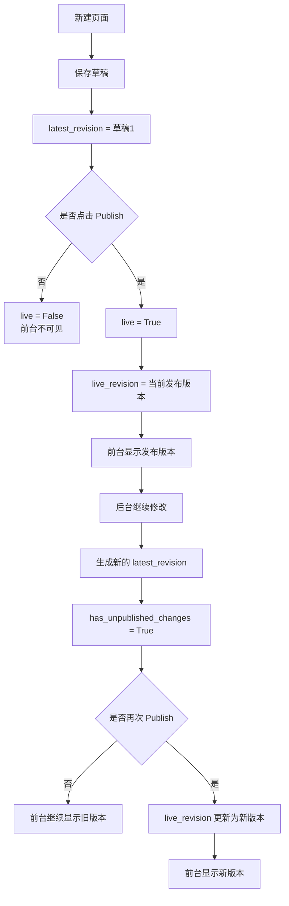
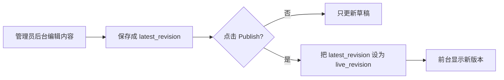

# Wagtail 页面发布状态说明

## 1. `live=True` 是什么

`live=True` 表示：

`这个页面已经处于“已发布”状态`

在 `Wagtail` 里，页面通常有两种状态：

- 草稿：后台改了，但前台访客看不到
- 已发布：前台访客可以访问

所以：

- `live=False`：还没正式发布
- `live=True`：已经正式发布

## 2. 它到底干啥用

`live` 的主要作用是区分：

- 这页是不是线上页面
- 普通访客能不能访问这页

但要注意：

`live=True` 不等于“你刚刚改的内容一定已经显示在前台”。

因为 `Wagtail` 还会区分：

- 当前线上版本
- 当前最新草稿版本

## 3. 要和哪些字段一起看

理解页面状态时，最重要的是这几个字段：

- `live`
- `latest_revision`
- `live_revision`
- `has_unpublished_changes`

它们的含义如下：

| 字段 | 含义 |
| --- | --- |
| `live` | 页面是否已上线 |
| `latest_revision` | 当前最新保存的版本，通常是最新草稿 |
| `live_revision` | 当前真正在线上显示的版本 |
| `has_unpublished_changes` | 草稿是否和线上版本不同 |

一句话总结：

- `live` 决定“页面是否已发布”
- `live_revision` 决定“前台当前显示的是哪一版”

## 4. 一个典型流程

### 场景 1：新建页面，还没发布

```text
live = False
latest_revision = 草稿1
live_revision = None
has_unpublished_changes = True
```

说明：

- 页面存在
- 后台已经有草稿
- 但前台访客看不到

### 场景 2：点击 Publish 后

```text
live = True
latest_revision = 版本1
live_revision = 版本1
has_unpublished_changes = False
```

说明：

- 页面已上线
- 最新版本就是线上版本
- 前台会显示版本 1

### 场景 3：页面已上线，但后台又改了新内容，还没重新发布

```text
live = True
latest_revision = 版本2
live_revision = 版本1
has_unpublished_changes = True
```

说明：

- 页面仍然在线上
- 但前台还显示旧版本 1
- 后台已经保存了新版本 2
- 只有再次点击 `Publish`，前台才会切到版本 2

## 5. 用 mermaid 看状态流转



## 6. 再换一种视角看



## 7. 你平时应该怎么判断页面状态

如果你发现：

- 后台明明改了
- 前台却没变化

优先怀疑这几种情况：

1. 只点了 `Save`，没点 `Publish`
2. 页面有 `has_unpublished_changes=True`
3. 当前前台显示的是旧的 `live_revision`
4. 浏览器缓存没刷新

## 8. 你这次碰到的问题本质上是什么

你这次遇到的是一个比较特殊的问题：

- 页面看起来是 `live=True`
- 但没有正确的 `live_revision`

这会导致：

- 页面表面上像“已上线”
- 实际上线上内容状态不完整
- 后台改动保存后，前台不按预期显示

这个问题已经在当前项目里修复了。

## 9. 对内容管理员的实际操作建议

日常维护时，可以按这个规则理解：

- `Save`：只是保存草稿
- `Publish`：才会更新前台

所以：

- 改了新闻正文后，想让访客看到，必须点 `Publish`
- 改了首页按钮文字后，想让前台更新，也必须点 `Publish`
- 如果只保存不发布，前台通常不会变

## 10. 一句话结论

`live=True` 的意思是“这页已经是发布状态”。  
但真正前台显示哪一版，还要看 `live_revision`。  
所以判断“为什么前台没更新”时，不能只看 `live`，要连着 `latest_revision` 和 `has_unpublished_changes` 一起看。
